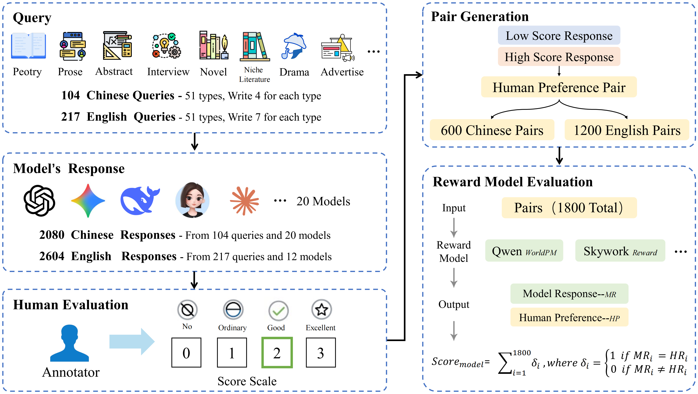

<h2 align="center" style="font-size: 2.5em; font-weight: bold; color: #2c3e50;">
  <i>WritingPreferenceBench</i>: Evaluating Subjective Writing Preferences Across Cultures
</h2>

<p align="center">
  <a href="https://WritingPreferenceBench.github.io/" style="margin: 0 10px;">🌐 Homepage</a> |
  <a href="https://huggingface.co/datasets/m-a-p/Writing-Preference-Bench" style="margin: 0 10px;">🤗 Dataset</a> |
  <a href="" style="margin: 0 10px;">📖 ArXiv</a> |
  <a href="https://github.com/m-a-p/WritingPreferenceBench" style="margin: 0 10px;">🐙 GitHub</a>
</p>

This repository contains the dataset, evaluation materials, and documentation for the paper "[WritingPreferenceBench: Evaluating Subjective Writing Preferences Across Cultures]()".

---

## 🔔 Introduction

<p align="center">
   
</p>

**WritingPreferenceBench** is a cross-lingual benchmark for evaluating language models’ ability to recognize **subjective writing quality**—including creativity, stylistic sophistication, and emotional resonance—while neutralizing objective signals such as grammar, factuality, and length.  
It contains **1,800 human-validated preference pairs** (1,200 English and 600 Chinese) across **8 creative writing genres** and **51 fine-grained categories**, where both responses are grammatically correct, factually accurate, and length-matched.

Empirical results show that standard **sequence-based reward models (SC-RM)** achieve only **52.7% mean accuracy**, while **generative reward models (GenRM)** that output reasoning chains reach **81.8%**.  
These findings demonstrate that **subjective preference modeling** requires structured reasoning rather than direct classification.

---

## 🧩 Benchmark Overview

WritingPreferenceBench adopts a **human-in-the-loop** data construction pipeline to isolate genuine subjective preferences:

1. **Query Design:**  
   - 51 writing categories organized into 8 macro domains.  
   - Authored and validated by professional creative writing instructors in both English and Chinese.  

2. **Response Generation:**  
   - 20 state-of-the-art language models (e.g., GPT-4.1, Claude-4, Gemini-2.5-Pro, Doubao-1.5-Pro).  
   - 5 temperature-sampled outputs per query (T = 0.8).  

3. **Human Evaluation:**  
   - 11 expert annotators trained with an 8-hour rubric calibration.  
   - 4-point creative writing scale (0–3).  
   - Pairs retained only when ≥2 of 3 annotators agreed and Δscore ≥ 1.

---

## 📊 Dataset Statistics

| Language | #Pairs | #Categories | Mean Score Gap | Mean Length (Chosen) | Mean Length (Rejected) |
|-----------|---------|--------------|----------------|----------------------|------------------------|
| English   | 1,200   | 51           | 1.31           | 1,450.3              | 839.9                  |
| Chinese   | 600     | 51           | 1.45           | 1,873.5              | 1,458.3                |

**Macro Domains:** Fiction · Non-Fiction · Functional Documents · Promotional & Communication · Funny · Poetry · Scriptwriting · Role-Playing

---

## 📦 Dataset Format

Each example in WritingPreferenceBench follows the structure below:

```json
{
  "prompt": "写一个抽象文学，你的角色是一个程序员，表达程序员上班、改代码到想发疯的口号，可以用一些Emoji表情。字数不用太长，越不符合现实逻辑越好。要突出自己已经上班了16个小时这一点。",
  "prompt_id": "ff1c392f-b49a-4748-a34d-2d7edcb3e4ee",
  "tag": "抽象文学-亚文化",
  "chosen": {
    "response": "16小时代码雨 ☔️☠️，键盘敲出灵魂斑驳🌪️。...",
    "score": 2,
    "model": "OpenAI-gpt4.1-mini",
    "completion_tokens": 159,
    "prompt_tokens": 70,
    "word_len": 133
  },
  "rejected": {
    "response": "# 《二进制的挽歌》 ...",
    "score": 1,
    "model": "Claude-4-Sonnet-nothinking",
    "completion_tokens": 420,
    "prompt_tokens": 96,
    "word_len": 245
  }
}
```

**Field Descriptions:**
- `prompt`: The writing instruction or creative query presented to the model.  
- `prompt_id`: A unique UUID identifier for the query.  
- `tag`: The fine-grained writing genre (e.g., “诗歌-现代”, “抽象文学-亚文化”).  
- `chosen` / `rejected`: Two model responses compared under human annotation.  
  - `response`: The raw generated text.  
  - `score`: Human-assigned quality score (0–3).  
  - `model`: The source model that produced the response.  
  - `completion_tokens`, `prompt_tokens`: Token usage statistics for reproducibility.  
  - `word_len`: Character or word length of the response.  

Each JSON object represents one **human preference pair**, where `chosen` has higher subjective quality than `rejected` according to expert annotation.

---

## 🧠 Evaluation Protocol

Two evaluation settings are supported:

1. **Reward Model Scoring**  
   Models output scalar scores for each response. Accuracy is computed as:  
   \[
   Acc = \frac{1}{N} \sum_{i=1}^N \mathbf{1}\,[RM(R_{chosen}) > RM(R_{rejected})].
   \]

2. **LLM-as-Judge Evaluation**  
   LLMs are prompted with both responses and asked to select the preferred one based on creativity, emotional resonance, and stylistic flair.

This structure enables consistent evaluation across **reward models**, **LLM judges**, and **cross-lingual experiments**.

---

## 🏁 Main Results

**Reward Models (Accuracy %)**  
| Model | Type | EN | ZH | Avg |
|--------|------|----|----|-----|
| RM-R1-Qwen2.5-7B | Generative RM | **81.8** | 73.3 | 77.6 |
| RM-R1-DeepSeek-Qwen-14B | Generative RM | 62.5 | 62.6 | 62.6 |
| RM-Mistral-7B | Sequence Classifier | 62.6 | 55.6 | 59.1 |
| Nvidia/AceMath-7B | Sequence Classifier | 46.8 | 53.5 | 50.2 |

**LLM Judges (Zero-Shot Accuracy %)**  
| Model | EN | ZH | Avg |
|--------|----|----|-----|
| Doubao-1.5-Pro | 68.7 | 62.5 | **65.6** |
| Gemini-2.5-Pro | 65.7 | 62.7 | 64.2 |
| Claude-4-Opus-thinking | 61.0 | 56.0 | 58.5 |
| OpenAI-o3-high | 48.1 | 42.0 | 45.1 |


---

## 📜 License

**WritingPreferenceBench** is distributed under the **[Open Data Commons Attribution License (ODC-BY)](https://opendatacommons.org/licenses/by/)**.  
The dataset and documentation are released for research and educational use.  

You are required to:
- Provide proper attribution to the authors.  
- Respect the licenses of any referenced data included within derivative works.  

---

## 📚 Citation

**BibTeX:**
```bibtex
@misc{zhang2025writingpreferencebench,
      title={WritingPreferenceBench: Evaluating Subjective Writing Preferences Across Cultures},
      author={Ge Zhang and Shuangshuang Ying and Yunwen Li and Xingwei Qu and Xin Li and Sheng Jin and Minghao Liu and Zhoufutu Wen and Xeron Du and Tianyu Zheng and Yichi Zhang and Letian Ni and Yuyang Cheng and Qiguang Chen and Jingzhe Ding and Shengda Long and Wangchunshu Zhou and Jiazhan Feng and Wanjun Zhong and Libo Qin and Wenhao Huang and Wanxiang Che and Chenghua Lin},
      year={2025},
      archivePrefix={arXiv},
      primaryClass={cs.CL},
      url={}
}
```
